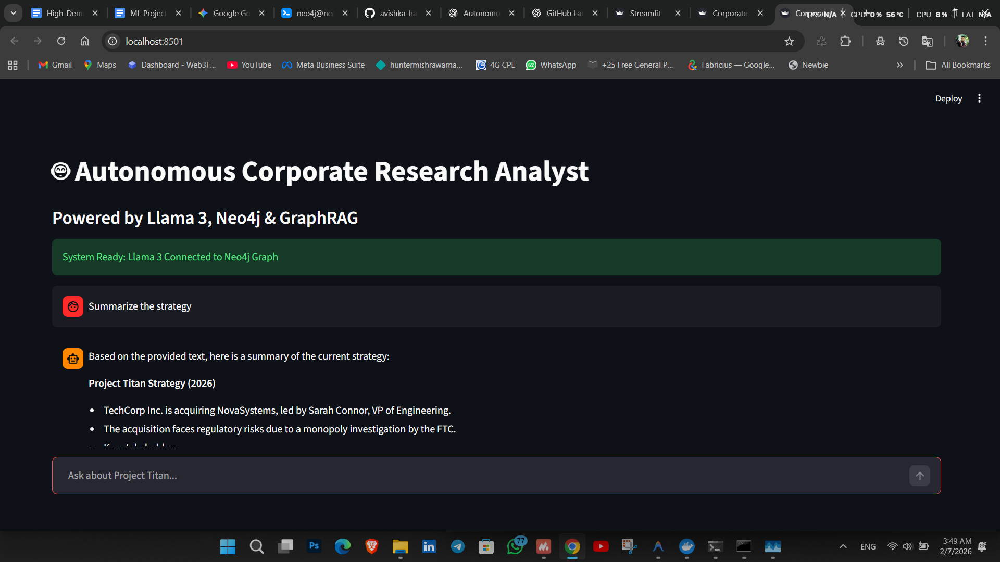

# The Corporate Analyst Agent



An autonomous AI agent designed to analyze corporate strategy documents using a **GraphRAG** (Graph Retrieval-Augmented Generation) approach. It combines structured data (Neo4j Graph) and unstructured data (Vector Search) to answer complex questions about organizational relationships and strategic risks.

## 🚀 Features

*   **Agentic Reasoning**: Uses `ManualAgent` logic to intelligently route queries to the correct tool.
*   **Graph Database (Neo4j)**: Maps entities like *People* and *Organizations* and their relationships (`REPORTS_TO`, `WORKS_FOR`).
*   **Vector Search**: Indexes document chunks for semantic search to answer abstract questions (e.g., "What are the risks?").
*   **Local LLM**: Powered entirely by local models using **Ollama** (`llama3`, `nomic-embed-text`).

## 🛠️ Prerequisites

1.  **Python 3.10+**
2.  **Neo4j Database**:
    *   Locally installed or via Docker (running on `bolt://localhost:7687`).
    *   APOC plugin enabled (recommended).
3.  **Ollama**:
    *   Install Ollama from [ollama.com](https://ollama.com).
    *   Pull the required models:
        ```bash
        ollama pull llama3
        ollama pull nomic-embed-text
        ```

## 📦 Installation

1.  **Clone the repository** (or navigate to the project folder).
2.  **Create a virtual environment**:
    ```bash
    python -m venv venv
    .\venv\Scripts\Activate.ps1  # Windows PowerShell
    # source venv/bin/activate # Mac/Linux
    ```
3.  **Install dependencies**:
    ```bash
    pip install -r requirements.txt
    ```
    *(Note: If `requirements.txt` is missing, ensure you have `langchain`, `langchain-community`, `langchain-ollama`, `neo4j` installed).*

4.  **Configure Environment**:
    Create a `.env` file in the root directory:
    ```env
    NEO4J_URI=bolt://localhost:7687
    NEO4J_USERNAME=neo4j
    NEO4J_PASSWORD=your_password
    ```

## ⚡ Quick Start

### 1. Generate & Ingest Data
First, create the dummy PDF and populate the knowledge graph.

```bash
# Generate the confidential PDF report
python create_data.py

# Ingest entities into the Graph (People, Orgs)
python src/ingest.py

# Ingest unstructured text into the Vector Store
python src/vector_store.py
```

### 2. Verify Data (Optional)
Check if the data was loaded correctly.
```bash
python verify_graph.py
```

### 3. Run the Agent
Start the interactive agent session.
```bash
python src/agent.py
```

## 🧪 Testing the Agent

The agent supports different types of reasoning. Try these queries:

*   **Graph Query (Relationships):**
    > "Who does Sarah Connor report to?"
    *Expected:* John Smith (retrieved from Graph).

*   **Vector Query (Context):**
    > "What are the risks mentioned in the report?"
    *Expected:* Regulatory risks / FTC investigation (retrieved from Vectors).

*   **Complex Query:**
    > "Who is leading the acquisition and what is the budget?"
    *Expected:* Sarah Connor / $500M (retrieved from Vectors/Graph).

## 📂 Project Structure

*   `src/agent.py`: Main agent logic. Contains the `ManualAgent` class and tool definitions.
*   `src/ingest.py`: PDF extraction and strictly structured Graph ingestion.
*   `src/vector_store.py`: Vector embedding generation and Neo4j indexing.
*   `create_data.py`: Generates the dummy `strategy_report.pdf` data source.
*   `verify_graph.py`: Diagnostic script to inspect database contents.

## 🔧 Troubleshooting

*   **Result "I don't know":**
    *   Ensure Ollama is running (`ollama serve`).
    *   Check if the graph is populated using `verify_graph.py`.
    *   If using Llama 3, ensure `src/agent.py` uses the strict `CYPHER_GENERATION_TEMPLATE` to avoid property name hallucinations (e.g. using `type` instead of `id`).

*   **Import Errors (`ModuleNotFoundError`):**
    *   This project avoids complex `langchain.agents` dependencies by using a custom `ManualAgent` implementation to ensure compatibility with various environment setups.
