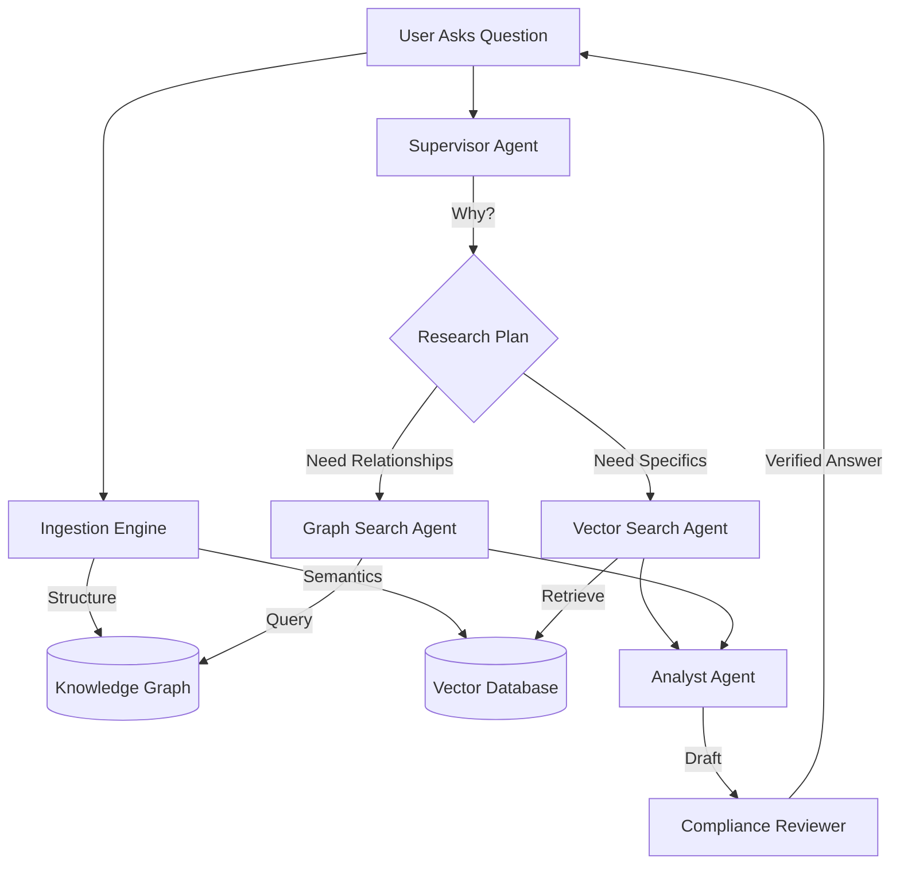

# 🤖 Corporate Analyst Agent

> **An Autonomous AI Research Assistant specifically designed for Corporate Strategy & Analysis.**  
> Powered by **Llama 3**, **LangGraph**, and **TiDB Serverless**.

## 📖 Overview

The **Corporate Analyst Agent** is a next-generation AI tool capable of performing deep research on complex corporate documents. Unlike traditional chatbots that simply predict the next word, this agent uses a **Cognitive Architecture** to plan, research, and verify information.

It combines **Knowledge Graphs** (to understand entities like *CEO*, *Competitor*, *Acquisition*) with **Vector Search** (to understand semantic meaning), ensuring that every answer is grounded strictly in the provided data.

## 🎯 The Problem Solved

Standard RAG (Retrieval-Augmented Generation) systems often fail on complex queries like *"How does the new regulation affect the subsidiary's risk profile?"* because they only look for matching keywords.

**This Agent solves that by:**
1.  **Extracting Structure**: It builds a graph of relationships from the document.
2.  **Multi-Step Reasoning**: It breaks down complex questions into sub-tasks (e.g., "Find subsidiary", "Check regulations", "Analyze risk").
3.  **No Hallucinations**: It explicitly refuses to answer if the information is not in the source text.

## ✨ Key Capabilities

*   **🕵️‍♂️ Autonomous Research**: The agent assumes the role of a "Supervisor" and assigns tasks to specialized workers ("Vector Searcher" and "Graph Searcher").
*   **🕸️ Knowledge Graph Extraction**: Automatically identifies and maps relationships between people, organizations, and concepts.
*   **🧠 Hybrid Intelligence**: Merges structured graph data with unstructured textual analysis for superior accuracy.
*   **⚡ Real-Time Processing**: optimized for speed and accuracy using Groq's LPU inference engine.
*   **📱 Modern Experience**: Features a "Premium Dark Mode" interface designed for professional analysts, fully responsive on all devices.

## 🏗️ How It Works

The system operates as a multi-agent workflow:

## 🛠️ Technology Stack

This project leverages the latest in AI and Cloud infrastructure:

*   **Large Language Model**: Meta Llama 3.1 (via Groq API)
*   **Orchestration**: LangChain & LangGraph
*   **Database**: TiDB Serverless (Unified Vector & Graph Store)
*   **Embeddings**: HuggingFace (`sentence-transformers`)
*   **Interface**: Streamlit (Python)

Link : https://autonomous-corporate-research-analyst.streamlit.app/

---
*Built for the future of Corporate Intelligence.*